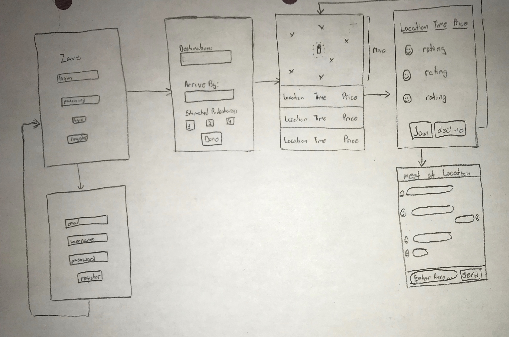
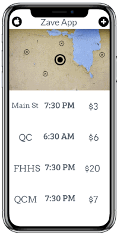
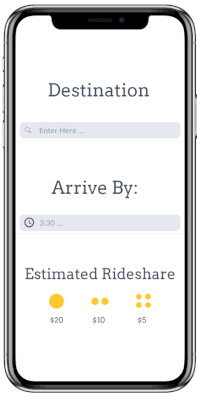
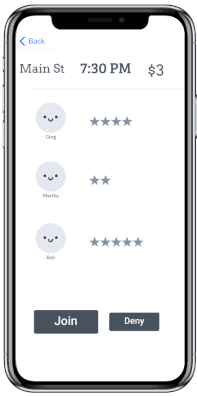
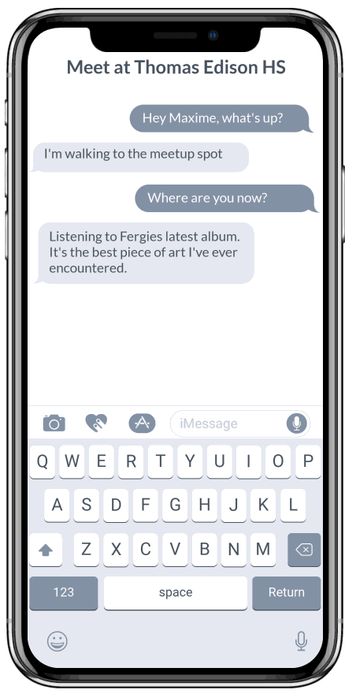
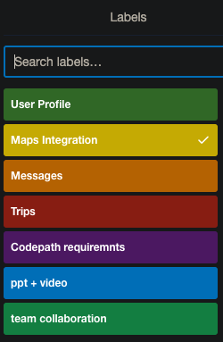
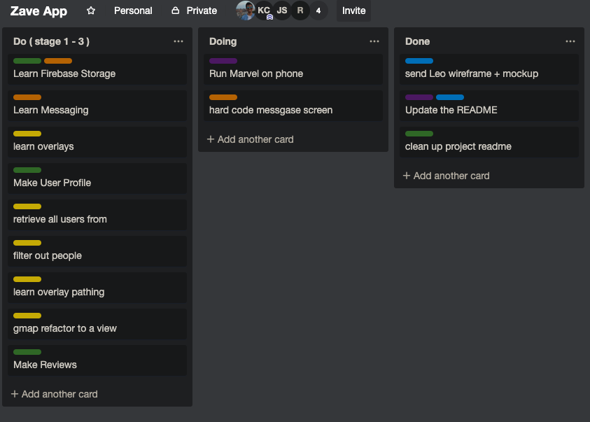

# Zave

## Contents
- [Overview](#Overview)
- [Product Spec](#Product-Spec)
- [Wireframes](#Wireframes)
- [Schema](#Schema)
- [Project Management](#Project-Management)
- [Roadblocks](#Roadblocks)
- [Updates Assignment 10](#Updates-Assignment-10)
- [Useful Links](#[Useful-Links)

## Overview
### The Problem we are solving
Making it easier for people to carpool by saving them money by finding similar destinations that people in the nearby area are hoping to go to.

### App Evaluation
- **Category:** Transportation
- **Mobile:** iOS Devices
- **Story:** Analyzes where the user's destination is; compares it to the destination that users want to go to in a similar location as the user; pairs those users together to set a meeting location to carpool together
- **Market:** This app would be great for students that live off-campus, people going to convention centers/expos, as well as for job travel
- **Habit:** This app would be primarily used when travelling by car from an urban location to another urban location
- **Scope:** This initially would act as a feature for rideshare companies, following the end product of this application, it can be implemented into various rideshare applications such as Uber and Lyft

## Product Spec
### 1. User Stories (Required and Optional)
**Our Dev Phases**
- Stage 1 : Wireframe on paper and Marvel (Required)
- Stage 2 : Simulator Mockup (Required)
- Stage 3 : Real Time Users (Required)
- Stage 4 : Plan Trips, Suggested Routes (Optional)
- Stage 5 : Profile and Payments (Optional)

### 2. Screen Archetypes
- Login
- Register (User sign up for an account)
- Trip Details 
  - User enters their destination, preferred arrival time, and preferred rideshares
- Possible Trips
  - Shows the user's current location
  - Shows current nearby users

### 3. Navigation

**Flow Navigation** (Screen to Screen)
- a. Forced Log-in -> Account creation if no log in is available
- b. Set Destination, Arrival Time, and preferred number of people that you would want in the rideshare
- c. Shows all the nearby users in current location heading in the same direction as you as well as rideshare options and to choose from
- d. After clicking the rideshare option, User is shown more details of the chosen rideshare option with ratings of the people in the rideshare, as well as a confirmation of the rideshare -> if decline then brought back to (c)
- e. User is brought to a messaging VC to determine with potential users of that rideshare where to meetup

## Wireframes

### [BONUS] Digital Wireframes & Mockups

### [BONUS] Interactive Prototype

## Schema 
- Google Firebase
- Google Storage

#### List of network requests
- Google Maps API
- Uber API

#### [OPTIONAL:] Existing API Endpoints

## Project Management
### Team Delegation
- __Yasin__ : Trips + git master
- __Joseph__ : oAuth/Profile + requirements
- __Bahti__  : Maps + algorithm
- __Kevin__  : Messaging + presentation 

### Stand-ups
- 4.24.19

## Roadblocks

## Updates Assignment 10
- Despite having several time constriants with school work and exams, we have started to work more on the application more frequently by bringing what was once on the marvel-demo to XCode. initially we worked on making the app as basic as possible without the implementation of API's. (4/29/2019)
- Before finals week take a toll on our work on the application, we will start to put more effort in the creation of the application. There is still much more work to be done before this project is complete. (5/15/2019) 
- Before meeting again tomorrow, we will be working on how to implement Google Storage and Google Firebase into our application.(5/18/2019)

## Useful Links
- [Codepath Readme Suggestion](https://github.com/codepath/me102_group_project_example#Product-Spec)
- [Super-Dope past project Readme - HackNYU](https://github.com/matthewbrod01/Uplift)

[Back to top](#contents)

